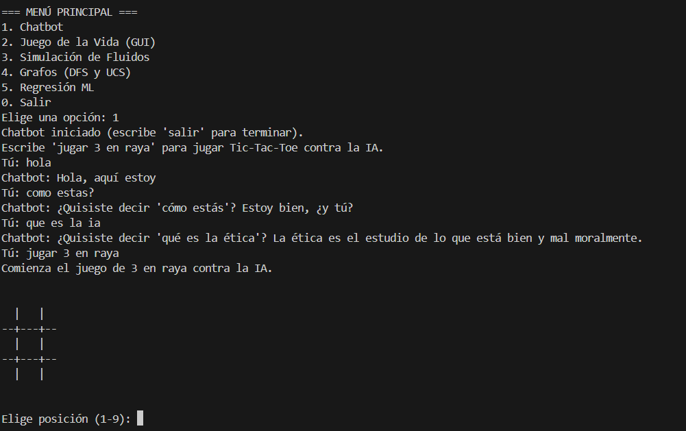
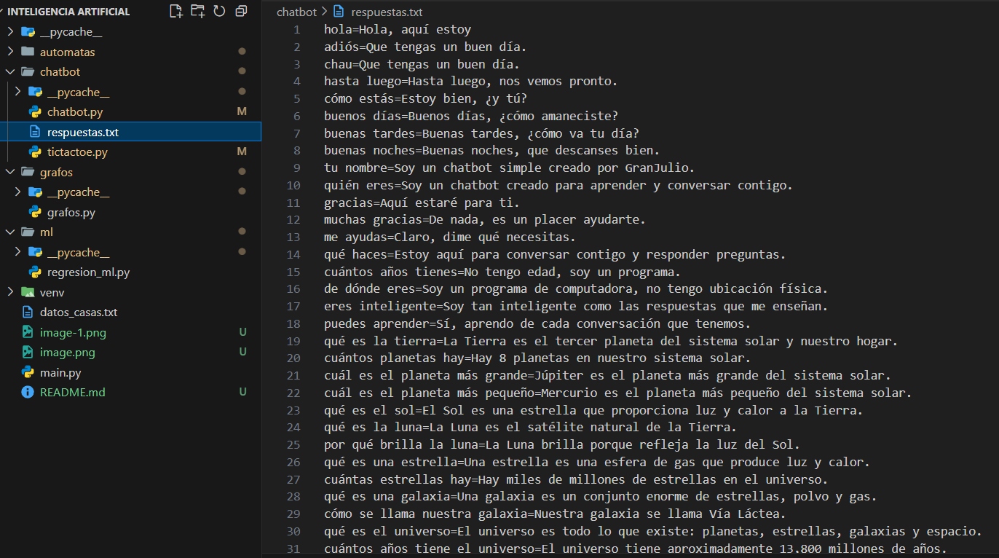
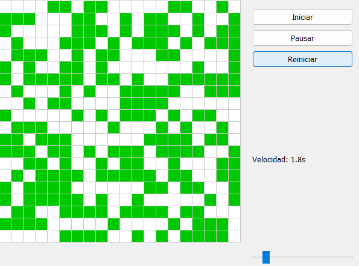
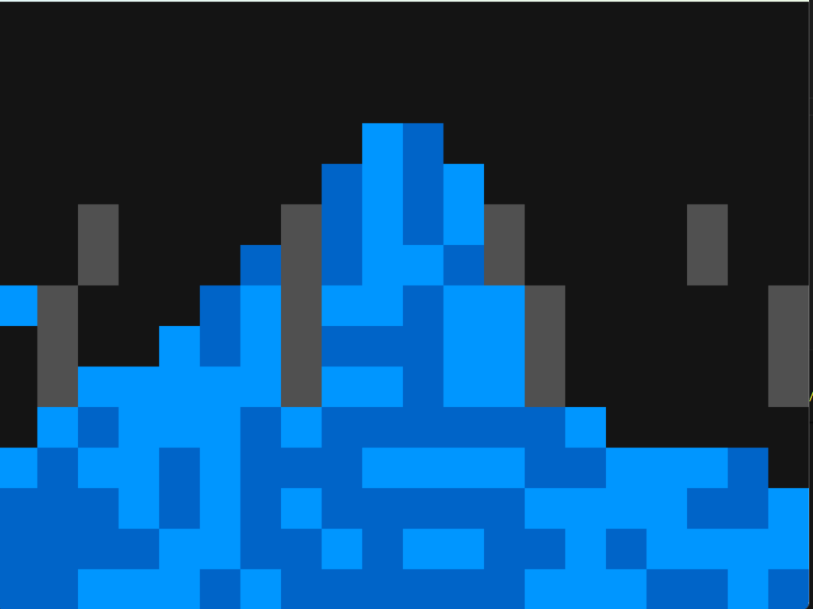
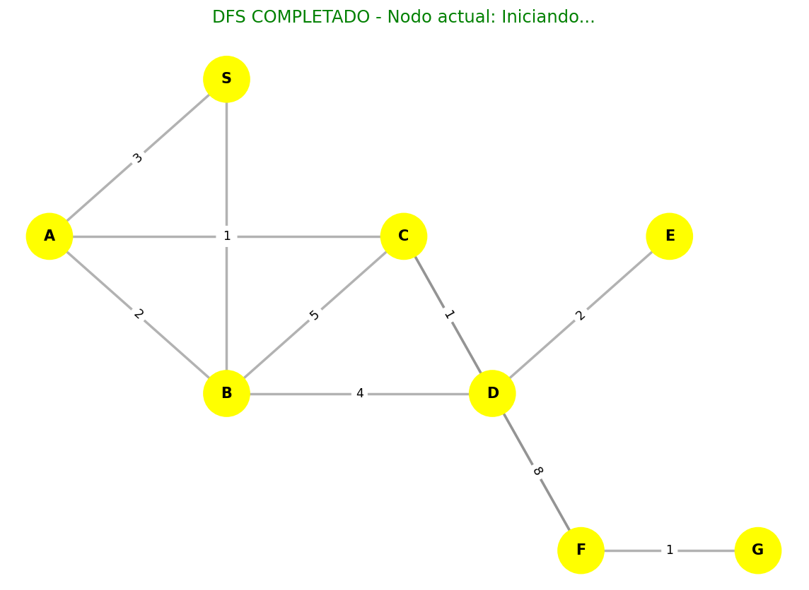
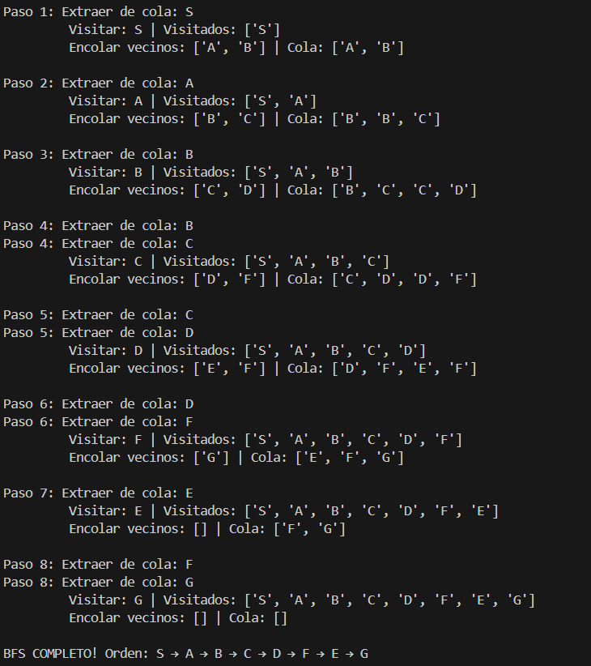
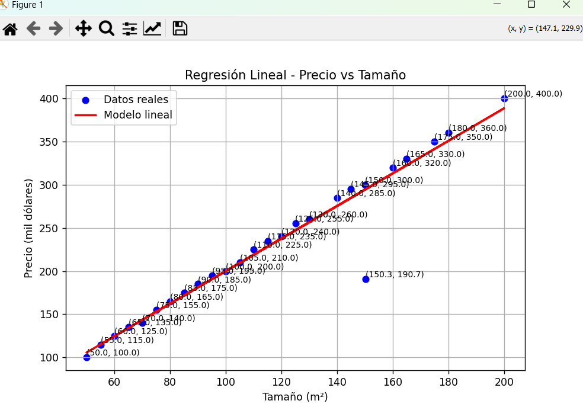
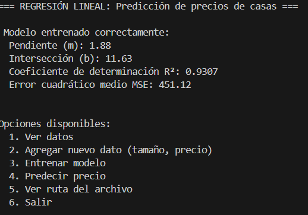

# Proyecto de Inteligencia Artificial

Este proyecto reúne diversas implementaciones interactivas y visuales relacionadas con la inteligencia artificial, autómatas celulares, juegos clásicos y aprendizaje automático, utilizando Python y librerías como `pygame`, `networkx`, `matplotlib` y `scikit-learn`.

---

##  Contenido del Proyecto

### 1.  Chatbot Inteligente

Interfaz por consola que permite mantener conversaciones simples y jugar al **Tres en Raya** (Tic-Tac-Toe) contra una inteligencia artificial.

**Archivos:**
- `chatbot/chatbot.py` — Lógica principal del chatbot y manejo del historial de conversación
- `chatbot/tictactoe.py` — Implementación del juego Tic-Tac-Toe con inteligencia artificial



**Funciones principales:**
- `responder(texto)` — Devuelve la respuesta del chatbot según el mensaje recibido
- `guardar_respuestas()` — Guarda el historial de conversación en un archivo "respuestas.txt"



---

### 2.  Juego de la Vida (Conway)

Simulación del autómata celular propuesto por John Conway, con visualización gráfica en tiempo real mediante `pygame`.

**Archivo:**  
- `automatas/juego_de_la_vida.py`

**Características:**
- Permite iniciar, pausar y reiniciar la simulación
- El usuario puede activar o desactivar células directamente en la cuadrícula
- Visualización intuitiva y control total del estado del sistema

---

### 3.  Simulación de Fluidos

Representación visual del movimiento de partículas de agua sobre una cuadrícula interactiva.

**Archivo:**  
- `automatas/simulacion_fluido.py`

**Controles:**
- **Clic izquierdo:** agrega partículas de agua
- **Clic derecho:** crea o elimina obstáculos

La simulación permite observar el comportamiento del flujo en tiempo real, utilizando `pygame` para la animación y renderizado.



---

### 4.  Algoritmos de Grafos (DFS, BFS, UCS)

Implementación visual de tres algoritmos clásicos de búsqueda:

- **DFS (Depth-First Search)** — Búsqueda en profundidad
- **BFS (Breadth-First Search)** — Búsqueda en anchura
- **UCS (Uniform Cost Search)** — Búsqueda de costo uniforme

**Archivo:**  
- `grafos/grafos.py`

**Funciones principales:**
- `dfs_step_by_step(graph, start)` — Recorrido en profundidad paso a paso
- `bfs_step_by_step(graph, start)` — Recorrido en anchura paso a paso
- `ucs_step_by_step(graph, start, goal)` — Búsqueda de costo uniforme
- `GraphVisualizer` — Clase para representar gráficamente los nodos, aristas y estados






La visualización se realiza mediante `networkx` y `matplotlib`.

---

### 5.  Regresión Lineal (Machine Learning)

Modelo de aprendizaje automático para predecir precios de viviendas según su tamaño (en m²).

**Archivo:**  
- `ml/regresion_ml.py`

**Funciones principales:**
- `leer_datos()` — Carga los datos desde `datos_casas.txt` (se genera automáticamente si no existe)
- `guardar_datos(datos)` — Guarda nuevos registros de entrenamiento
- `entrenar_modelo(datos)` — Ajusta el modelo de regresión lineal
- `predecir(modelo, tamaño, datos)` — Calcula el precio estimado
- `graficar_modelo(modelo, datos)` — Muestra la recta de regresión junto a los puntos de datos




---

##  Estructura del Proyecto

```
Inteligencia-Artificial/
│
├── chatbot/
│   ├── chatbot.py
│   └── tictactoe.py
│
├── automatas/
│   ├── juego_de_la_vida.py
│   └── simulacion_fluido.py
│
├── grafos/
│   └── grafos.py
│
├── ml/
│   └── regresion_ml.py
│
├── datos_casas.txt
├── main.py
└── README.md
```

---

##  Instalación y Ejecución

### Requisitos Previos

- Python **3.9 o superior** instalado en el sistema
- pip (gestor de paquetes de Python)

### Instalación y Configuración

#### Paso 1: Clonar el repositorio

Abre una terminal y ejecuta:

```bash
git clone https://github.com/JSEduardoM/Inteligencia-Artificial.git
```

#### Paso 2: Acceder al directorio del proyecto

```bash
cd Inteligencia-Artificial
```

#### Paso 3: Instalar las dependencias necesarias

Asegúrate de tener Python 3.9 o superior instalado. Luego ejecuta el siguiente comando para instalar las librerías requeridas:

```bash
pip install pygame networkx matplotlib scikit-learn numpy
```

#### Paso 4: Ejecutar el programa principal

Una vez instaladas las dependencias, inicia el programa con:

```bash
python main.py
```

###  Uso de entorno virtual (recomendado)

Si prefieres utilizar un entorno virtual para mantener las dependencias aisladas:

**En Linux/Mac:**
```bash
python -m venv venv
source venv/bin/activate
pip install pygame networkx matplotlib scikit-learn numpy
python main.py
```

**En Windows:**
```bash
python -m venv venv
venv\Scripts\activate
pip install pygame networkx matplotlib scikit-learn numpy
python main.py
```

---

##  Dependencias

| Librería | Descripción |
|----------|-------------|
| `pygame` | Framework para desarrollo de juegos y gráficos interactivos |
| `PyQt5` | Framework para crear interfaces gráficas de usuario (GUI) |
| `networkx` | Análisis y visualización de grafos |
| `matplotlib` | Creación de gráficos y visualización de datos |
| `scikit-learn` | Algoritmos de aprendizaje automático |
| `numpy` | Computación numérica y manejo de arrays |

---